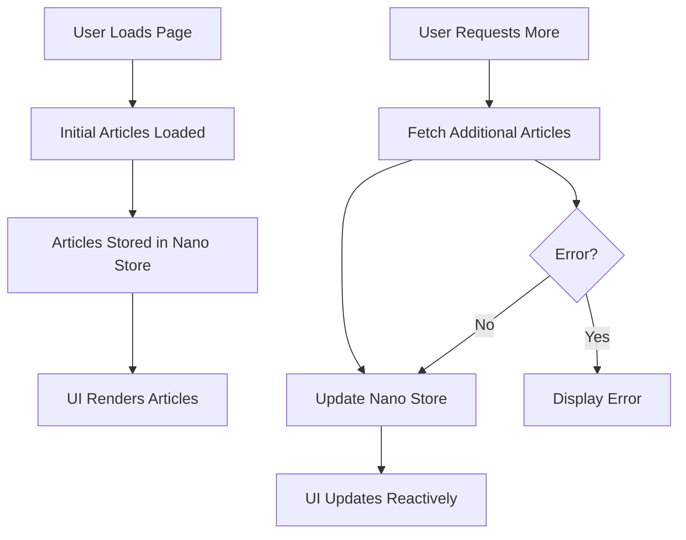

# Design Document: Article Loading Store

## Overview

This design document outlines the implementation of a reactive article loading system using nano stores. The system will allow for dynamic loading of articles without page refreshes, improving the user experience while maintaining efficient resource usage. The implementation will leverage the existing nano store pattern already used in the project and integrate with the current Astro and React components.

### Server-Side Rendering Preservation

A key design consideration is preserving Astro's server-side rendering (SSR) capabilities while adding client-side reactivity. This design ensures:

1. **Initial Render**: The initial set of articles will still be server-rendered by Astro for optimal performance and SEO
2. **Progressive Enhancement**: Client-side functionality (loading more articles) will be added as progressive enhancement
3. **Hydration Strategy**: The nano store will be hydrated with the server-rendered articles on client load
4. **SEO Preservation**: All critical content will be available in the initial server render

## Architecture

The architecture will follow a store-based approach with clear separation of concerns:

1. **Article Store**: A nano store that maintains the state of loaded articles, pagination information, loading status, and error states.
2. **Article Service**: Functions for fetching articles and updating the store.
3. **UI Components**: React components that consume the store and render articles reactively.

### High-Level Flow



## Components and Interfaces

### 1. Article Store

The article store will be implemented using nano stores' `map` function to maintain a structured state object:

```typescript
// src/stores/articleStore.js
import { map } from 'nanostores';

export const $articleStore = map({
  articles: [],        // Array of loaded articles
  page: 1,             // Current page number
  hasMore: true,       // Whether more articles are available
  isLoading: false,    // Loading state
  error: null          // Error state
});

// Actions
export function setArticles(articles) {
  $articleStore.setKey('articles', articles);
}

export function appendArticles(newArticles) {
  const currentArticles = $articleStore.get().articles;
  $articleStore.setKey('articles', [...currentArticles, ...newArticles]);
}

export function setPage(page) {
  $articleStore.setKey('page', page);
}

export function setHasMore(hasMore) {
  $articleStore.setKey('hasMore', hasMore);
}

export function setLoading(isLoading) {
  $articleStore.setKey('isLoading', isLoading);
}

export function setError(error) {
  $articleStore.setKey('error', error);
}

export function resetStore() {
  $articleStore.set({
    articles: [],
    page: 1,
    hasMore: true,
    isLoading: false,
    error: null
  });
}
```

### 2. Article Service

The article service will handle fetching articles and updating the store:

```typescript
// src/services/articleService.js
import { 
  $articleStore, 
  appendArticles, 
  setLoading, 
  setError, 
  setHasMore, 
  setPage 
} from '../stores/articleStore';

const POSTS_PER_PAGE = 10;

export async function loadInitialArticles() {
  try {
    setLoading(true);
    setError(null);
    
    // Fetch initial articles (implementation will depend on how articles are sourced)
    const articles = await fetchArticles(1, POSTS_PER_PAGE);
    
    appendArticles(articles);
    setPage(1);
    setHasMore(articles.length === POSTS_PER_PAGE);
  } catch (error) {
    setError('Failed to load articles');
    console.error('Error loading articles:', error);
  } finally {
    setLoading(false);
  }
}

export async function loadMoreArticles() {
  const { page, isLoading, hasMore } = $articleStore.get();
  
  if (isLoading || !hasMore) return;
  
  try {
    setLoading(true);
    setError(null);
    
    const nextPage = page + 1;
    const newArticles = await fetchArticles(nextPage, POSTS_PER_PAGE);
    
    appendArticles(newArticles);
    setPage(nextPage);
    setHasMore(newArticles.length === POSTS_PER_PAGE);
  } catch (error) {
    setError('Failed to load more articles');
    console.error('Error loading more articles:', error);
  } finally {
    setLoading(false);
  }
}

// This function will use the client-side cached article data
// to avoid re-fetching from the server
async function fetchArticles(page, limit) {
  // Use the data hydrated from SSR
  const { allArticles, totalArticles } = window.__ARTICLE_DATA__ || { allArticles: [], totalArticles: 0 };
  
  // Calculate start and end indices for pagination
  const startIndex = (page - 1) * limit;
  const endIndex = Math.min(startIndex + limit, totalArticles);
  
  // Simulate network delay for a more realistic experience
  await new Promise(resolve => setTimeout(resolve, 300));
  
  // Return the paginated articles
  return allArticles.slice(startIndex, endIndex);
}
```

### 3. React Components

#### ArticlesList Component (React version)

For client-side rendering of newly loaded articles, we'll create a component that only renders articles beyond the initial server-rendered set:

```jsx
// src/components/ArticlesList.jsx
import { useStore } from '@nanostores/react';
import { $articleStore } from '../stores/articleStore';

export function ArticlesList() {
  const { articles, isLoading } = useStore($articleStore);
  
  // Skip the initial articles that are already server-rendered
  // Only render articles loaded client-side
  const initialArticleCount = window.__ARTICLE_DATA__?.initialCount || 10;
  const clientSideArticles = articles.slice(initialArticleCount);
  
  if (clientSideArticles.length === 0) return null;
  
  return (
    <ul id="client-articles-list" className="grid grid-cols-[repeat(auto-fill,minmax(320px,1fr))] gap-8 w-full">
      {clientSideArticles.map((article) => (
        <li key={article.url} className="border border-border p-4 rounded-lg bg-card md:h-[420px] overflow-hidden transition-colors hover:bg-muted/50 group article-item">
          <a href={article.url} className="block h-full">
            <h2 className="text-4xl md:text-5xl mb-1 font-heading font-extrabold text-primary group-hover:underline">{article.title}</h2>
            <p className="text-muted-foreground mb-4 font-heading text-sm">{article.formattedDate}</p>
            <p className="text-foreground leading-7 text-lg">
              {article.description}
            </p>
          </a>
        </li>
      ))}
      
      {isLoading && (
        <li className="col-span-full text-center p-4">
          <div className="loading-spinner">Loading more articles...</div>
        </li>
      )}
    </ul>
  );
}
```

#### ArticlesListWrapper Component (Updated)

```jsx
// src/components/ArticlesListWrapper.jsx
import { useEffect } from 'react';
import { useStore } from "@nanostores/react";
import { $isMobileMenuOpen } from "../stores/mobileMenuStore";
import { $articleStore, setArticles, setHasMore } from '../stores/articleStore';
import { loadMoreArticles } from '../services/articleService';
import { ArticlesList } from './ArticlesList';

const ArticlesListWrapper = ({ initialArticles, hasMore, totalArticles, allArticles }) => {
  const isMobileMenuOpen = useStore($isMobileMenuOpen);
  
  useEffect(() => {
    // Hydrate the store with server-rendered articles
    setArticles(initialArticles);
    setHasMore(hasMore);
    
    // Store the full article list for client-side pagination
    // This avoids re-fetching from the server
    window.__ARTICLE_DATA__ = {
      allArticles,
      totalArticles,
      initialCount: initialArticles.length
    };
  }, [initialArticles, hasMore, totalArticles, allArticles]);
  
  // Don't render the "load more" UI when mobile menu is open
  if (isMobileMenuOpen) {
    return null;
  }
  
  // Only render the "load more" button and any client-side UI
  // The initial articles are already rendered by Astro
  return (
    <div className="articles-client-controls">
      <ArticlesList />
      <ArticlesLoadMore />
    </div>
  );
};

// Separate component for the "load more" functionality
const ArticlesLoadMore = () => {
  const { isLoading, error, hasMore } = useStore($articleStore);
  
  if (!hasMore) return null;
  
  return (
    <div className="text-center mt-8">
      {error && (
        <div className="text-red-500 mb-4">
          {error}. <button onClick={() => loadMoreArticles()} className="underline">Try again</button>
        </div>
      )}
      
      <button 
        onClick={() => loadMoreArticles()} 
        disabled={isLoading}
        className="bg-primary text-primary-foreground hover:bg-primary/90 px-4 py-2 rounded-lg disabled:opacity-50"
      >
        {isLoading ? 'Loading...' : 'More'}
      </button>
    </div>
  );
};

export default ArticlesListWrapper;
```

### 4. Integration with Astro

To integrate this React-based solution with Astro while preserving server-side rendering, we'll create an Astro component that:
1. Server-renders the initial articles
2. Hydrates the nano store with these articles on the client
3. Enables client-side loading of additional articles

```astro
---
// src/components/ArticlesContainer.astro
import ArticlesListWrapper from './ArticlesListWrapper';
import { formatArticlePublishedDate } from "../utils/helpers";
import type { IPost } from "../types/post";

// Server-side article fetching (similar to current implementation)
const getPubDate = (post: string | any) =>
    new Date(post.frontmatter.pubDate || post.frontmatter.published).valueOf();

const allPosts = await Promise.all(Object.values(import.meta.glob("/src/pages/blog/**/*.{md,mdx}"))
    .map(async (item) => await item())
) as IPost[];

const filterFn = (post: IPost): boolean =>
    Boolean(post.frontmatter.pubDate || post.frontmatter.published);

const posts = allPosts
    .filter(filterFn)
    .sort((a, b) => getPubDate(b) - getPubDate(a));

const postsPerPage = 10;

// Format articles for both SSR and client hydration
const initialArticles = posts.slice(0, postsPerPage).map((post) => ({
    url: post.url,
    title: post.frontmatter.title,
    description: post.frontmatter.description,
    formattedDate: formatArticlePublishedDate(post),
}));

const hasMoreArticles = posts.length > postsPerPage;
const totalArticles = posts.length;

// Format all articles for client-side use
const clientArticles = posts.map((post) => ({
    url: post.url,
    title: post.frontmatter.title,
    description: post.frontmatter.description,
    formattedDate: formatArticlePublishedDate(post),
}));
---

<!-- Server-rendered initial articles -->
<div id="ssr-articles">
  <ul class="grid grid-cols-[repeat(auto-fill,minmax(320px,1fr))] gap-8 mt-12 w-full [&>li:first-child]:md:col-span-2">
    {initialArticles.map((article) => (
      <li class="border border-border p-4 rounded-lg bg-card md:h-[420px] overflow-hidden transition-colors hover:bg-muted/50 group article-item">
        <a href={article.url} class="block h-full">
          <h2 class="text-4xl md:text-5xl mb-1 font-heading font-extrabold text-primary group-hover:underline">{article.title}</h2>
          <p class="text-muted-foreground mb-4 font-heading text-sm">{article.formattedDate}</p>
          <p class="text-foreground leading-7 text-lg">
            {article.description}
          </p>
        </a>
      </li>
    ))}
  </ul>
</div>

<!-- Client-side reactive component for "load more" functionality -->
<ArticlesListWrapper 
  client:load 
  initialArticles={initialArticles} 
  hasMore={hasMoreArticles}
  totalArticles={totalArticles}
  allArticles={clientArticles}
/>

<script>
  // Any client-side initialization that needs to happen outside React
  document.addEventListener('astro:page-load', () => {
    // This event fires when a page is loaded via Astro's view transitions
    // We could potentially use this to reset or initialize the store when navigating
  });
</script>
```

## Data Models

### Article Model

We'll extend the existing `IPost` interface to create a client-side article model:

```typescript
// src/types/article.ts
export interface Article {
  url: string;
  title: string;
  description: string;
  formattedDate: string;
  // Any additional fields needed for display
}

export interface ArticleStoreState {
  articles: Article[];
  page: number;
  hasMore: boolean;
  isLoading: boolean;
  error: string | null;
}
```

## Error Handling

The system will handle errors at multiple levels:

1. **Service Level**: Catch and log errors during article fetching
2. **Store Level**: Store error state for UI consumption
3. **UI Level**: Display error messages and retry options

Error states will be managed in the store and displayed in the UI with appropriate retry mechanisms.

## Testing Strategy

### Unit Tests

1. **Store Tests**: Verify store actions correctly update state
2. **Service Tests**: Mock fetch requests and verify store updates
3. **Component Tests**: Test rendering of articles, loading states, and error handling

### Integration Tests

1. Test the full flow from initial load to loading more articles
2. Test error handling and recovery
3. Test store persistence when navigating away and back

### E2E Tests

1. Verify articles load correctly on page load
2. Verify "Load More" functionality works as expected
3. Test behavior with network errors

## Performance Considerations

1. **Lazy Loading**: Articles will be loaded on demand to minimize initial page load
2. **State Persistence**: Store state will persist during navigation to avoid reloading
3. **Optimistic UI Updates**: UI will update optimistically while new data is loading
4. **Throttling**: Implement throttling for rapid "Load More" clicks

## Accessibility Considerations

1. Ensure loading states are properly announced to screen readers
2. Maintain focus management when new content is loaded
3. Provide appropriate ARIA attributes for dynamic content

## Implementation Notes

1. The implementation will leverage the existing nano stores pattern
2. We'll need to adapt the current Astro-based article loading to work with the React components
3. The solution should maintain compatibility with both client-side navigation and direct URL access