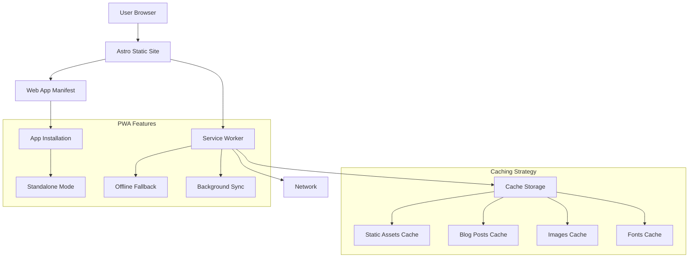

# Design Document

## Overview

This design document outlines the technical approach for implementing a fully-featured Progressive Web App (PWA) for the Astro blog. The implementation will build upon the existing VitePWA configuration to achieve a perfect Lighthouse PWA score while providing offline functionality, installability, and optimal performance.

The design leverages the existing `@vite-pwa/astro` integration and enhances it with custom caching strategies, offline fallbacks, and mobile-optimized meta tags to meet all modern PWA standards.

## Architecture

### High-Level Architecture



### Service Worker Strategy

The PWA will use Workbox with a hybrid caching approach:

1. **Precaching**: Critical static assets (HTML, CSS, JS, fonts)
2. **Runtime Caching**: Blog posts, images, and dynamic content
3. **Stale-While-Revalidate**: For frequently accessed content
4. **Cache-First**: For static assets and images

### Deployment Architecture

- **Static Site Generation**: Astro builds to `./docs` directory
- **GitHub Pages**: Serves from root domain `giwan.github.io`
- **Service Worker Scope**: Root path `/` for maximum coverage
- **Asset Optimization**: Automatic compression and optimization via Vite

## Components and Interfaces

### 1. VitePWA Configuration

**Location**: `astro.config.mjs`

**Configuration Structure**:
```javascript
VitePWA({
  scope: '/',
  registerType: 'autoUpdate',
  workbox: {
    navigateFallback: '/offline.html',
    runtimeCaching: [
      // Blog posts caching strategy
      // Images caching strategy  
      // Fonts caching strategy
    ],
    globPatterns: ['**/*.{js,css,html,ico,png,svg,webp}']
  },
  manifest: {
    // Will be generated from public/manifest.webmanifest
  }
})
```

### 2. Web App Manifest

**Location**: `public/manifest.webmanifest`

**Key Properties**:
- `name`: "Giwan Blog"
- `short_name`: "G1"
- `theme_color`: "#272822"
- `background_color`: "#808080" (gray)
- `display`: "standalone"
- `start_url`: "/"
- `scope`: "/"

### 3. Enhanced BaseHead Component

**Location**: `src/components/BaseHead.astro`

**Enhancements**:
- Apple-specific PWA meta tags
- Enhanced mobile viewport configuration
- iOS splash screen meta tags
- Windows tile configuration

### 4. Offline Fallback Page

**Location**: `src/pages/offline.astro`

**Features**:
- Simple, lightweight design
- Cached content suggestions
- Network status indicator
- Retry mechanism

### 5. Update Notification Component

**Location**: `src/components/UpdateNotification.tsx`

**Features**:
- Non-intrusive toast notification
- Update acceptance/dismissal
- Service worker update handling

## Data Models

### Cache Storage Structure

```typescript
interface CacheStrategy {
  name: string;
  pattern: RegExp;
  handler: 'CacheFirst' | 'StaleWhileRevalidate' | 'NetworkFirst';
  options: {
    cacheName: string;
    expiration?: {
      maxEntries: number;
      maxAgeSeconds: number;
    };
  };
}

interface BlogPostCache {
  url: string;
  timestamp: number;
  content: string;
  metadata: {
    title: string;
    description: string;
    publishDate: string;
  };
}
```

### Service Worker Registration

```typescript
interface PWAConfig {
  scope: string;
  registerType: 'prompt' | 'autoUpdate';
  workbox: {
    navigateFallback: string;
    runtimeCaching: CacheStrategy[];
    globPatterns: string[];
  };
}
```

## Error Handling

### Offline Scenarios

1. **Cached Content Available**: Serve from cache with offline indicator
2. **No Cached Content**: Display offline fallback page
3. **Partial Content**: Show available content with missing content indicators

### Service Worker Errors

1. **Registration Failure**: Graceful degradation to normal web experience
2. **Cache Corruption**: Automatic cache cleanup and regeneration
3. **Update Failures**: Retry mechanism with exponential backoff

### Network Error Handling

```javascript
// Fallback strategy for failed network requests
const fallbackStrategy = {
  html: '/offline.html',
  image: '/icons/offline-image.svg',
  font: 'system-fonts'
};
```

## Testing Strategy

### Lighthouse Audits

**Target Scores**:
- PWA: 100/100
- Performance: 90+
- Accessibility: 95+
- Best Practices: 95+
- SEO: 95+

**Key PWA Criteria**:
- ✅ Web app manifest
- ✅ Service worker
- ✅ Works offline
- ✅ Installable
- ✅ Splash screen
- ✅ Themed address bar
- ✅ Maskable icon

### Manual Testing Checklist

1. **Installation Testing**:
   - Chrome install prompt appears
   - App installs correctly on mobile/desktop
   - Standalone mode functions properly
   - Icons and splash screen display correctly

2. **Offline Testing**:
   - Previously visited pages load offline
   - Offline fallback displays for uncached content
   - Network reconnection updates content

3. **Caching Testing**:
   - Static assets cache properly
   - Blog posts cache after visit
   - Cache expiration works correctly
   - Cache size limits respected

4. **Cross-Platform Testing**:
   - iOS Safari PWA features
   - Android Chrome installation
   - Desktop installation (Chrome, Edge)
   - Various screen sizes and orientations

### Automated Testing

```javascript
// Service worker testing
describe('Service Worker', () => {
  test('registers successfully', async () => {
    // Test SW registration
  });
  
  test('caches critical resources', async () => {
    // Test precaching
  });
  
  test('serves offline content', async () => {
    // Test offline functionality
  });
});
```

## Performance Considerations

### Caching Strategy Optimization

1. **Critical Path Caching**: Immediate caching of essential resources
2. **Lazy Loading**: Non-critical resources cached on demand
3. **Cache Partitioning**: Separate caches for different content types
4. **Compression**: Gzip/Brotli compression for cached content

### Bundle Size Management

- Service worker kept under 100KB
- Manifest file optimized for minimal size
- Icon optimization for various sizes
- Lazy loading of PWA-specific components

### Network Optimization

```javascript
// Stale-while-revalidate for blog posts
{
  urlPattern: /\/blog\/.*/,
  handler: 'StaleWhileRevalidate',
  options: {
    cacheName: 'blog-posts',
    expiration: {
      maxEntries: 50,
      maxAgeSeconds: 30 * 24 * 60 * 60 // 30 days
    }
  }
}
```

## Security Considerations

### Service Worker Security

- HTTPS-only deployment (GitHub Pages provides this)
- Same-origin policy enforcement
- Content Security Policy compatibility
- Secure cache key generation

### Manifest Security

- Proper origin validation
- Icon source verification
- Start URL validation
- Scope restriction to prevent hijacking

## Deployment Strategy

### Build Process

1. **Pre-build**: Generate search data, optimize assets
2. **Build**: Astro static site generation with PWA integration
3. **Post-build**: Service worker generation, manifest validation
4. **Deploy**: Push to GitHub Pages

### GitHub Pages Configuration

```yaml
# .github/workflows/deploy.yml
- name: Build and Deploy
  run: |
    npm run build
    # Service worker and manifest are automatically generated
    # Deploy ./docs directory to GitHub Pages
```

### Cache Invalidation Strategy

- Service worker versioning via build hash
- Manifest updates trigger app updates
- Static asset cache busting via Vite
- Manual cache clearing for major updates

## Monitoring and Analytics

### PWA Metrics Tracking

- Installation rates
- Offline usage patterns
- Cache hit/miss ratios
- Update acceptance rates

### Performance Monitoring

- Service worker performance
- Cache storage usage
- Network request patterns
- User engagement metrics

This design provides a comprehensive approach to implementing a production-ready PWA that meets all requirements while maintaining optimal performance and user experience.