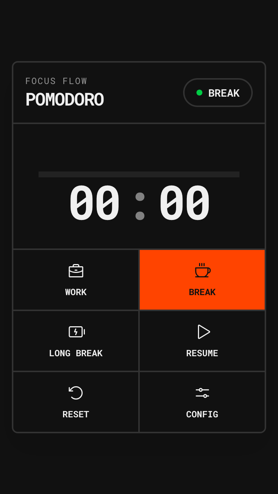

I used Google's [**Antigravity IDE**](https://antigravity.google/) to create a pomodoro app [pomo.mytoori.com](https://pomo.mytoori.com/) using [SolidJS](https://start.solidjs.com/). I chose a simple application that can work standalone, but it's important that the app supports PWA features. SolidJS keeps the bundle size small and performance high.



I tried to get [aistudio.google.com](https://aistudio.google.com) to setup a SolidJS project before but it struggled. Antigravity was able to do that a lot better.

## The Tech Stack

For this project, I went with a modern, lightweight stack:

-   **[SolidJS](https://www.solidjs.com/)**: For its fine-grained reactivity and lack of a Virtual DOM.
-   **[Vite](https://vitejs.dev/)**: As the build tool for a fast development experience.
-   **[TypeScript](https://www.typescriptlang.org/)**: To ensure type safety across the application.
-   **[Phosphor Icons](https://phosphoricons.com/)**: Specifically the `phosphor-solid` library for clean, consistent iconography.

## Key Features

### State Management
I implemented a custom hook, `usePomodoro`, to handle the timer logic and state. To ensure the user doesn't lose their progress if they accidentally close the tab, I used `localStorage` to persist the current mode (Work/Break), timer status, and remaining time.

### Audio without Assets
Instead of loading external MP3 files for the notification sounds, I used the **Web Audio API**. The `playNotificationSound` utility creates an oscillator to generate a simple "beep" directly in the browser. This keeps the project self-contained and reduces network requests.

```ts
// Simple example of the oscillator logic
const ctx = new AudioContext();
const osc = ctx.createOscillator();
osc.frequency.setValueAtTime(880, ctx.currentTime); // A5
osc.start();
osc.stop(ctx.currentTime + 0.5);
```

### PWA Capabilities
I'm especially happy with how relatively easily Antigravity was able to setup the PWA features using `vite-plugin-pwa`. It configured the manifest and service worker so the app is installable on mobile devices and works offline.

### Performance
The entire thing loads at 1.5 seconds on regular 3G connection (simulated through Firefox Developer Edition). Naturally it's much faster on a fast connection.

## The Developer Experience

Overall, the process was relatively smooth, though not without its challenges. Antigravity had a few startup issues where the model would occasionally run into an error or get stuck, requiring me to nudge it to continue. I suspect this is a temporary hiccup as it seemed to improve as I worked.

### The Wins

One area where Antigravity really shined was in the **design and layout** of the project. It was able to suggest and implement a clean, functional design that met my requirements with minimal fuss.

### Clean Code
I added an `AGENTS.md` file to the project root to guide the AI towards writing cleaner code. While not perfect—I find almost all AI coding assistants struggle to fully adhere to strict architectural guidelines—it did help in keeping the components relatively small and focused.

### Browser Preview
Antigravity has a built-in browser preview feature. It opened Chrome by default, but I hit a snag when trying to configure it to use Chrome Canary. It's a minor annoyance but something to note if you rely on specific browser versions for development.

## Conclusion

Building `basic-pomo` with Antigravity was a pretty good experience. While there are still some rough edges to smooth out, especially regarding the model's consistency, it proved to be a capable assistant for rapid prototyping. The ability to go from a prompt to a working, installable PWA with a custom design in a short amount of time is impressive.

> **Note:** This article was also drafted and reviewed with Antigravity.
