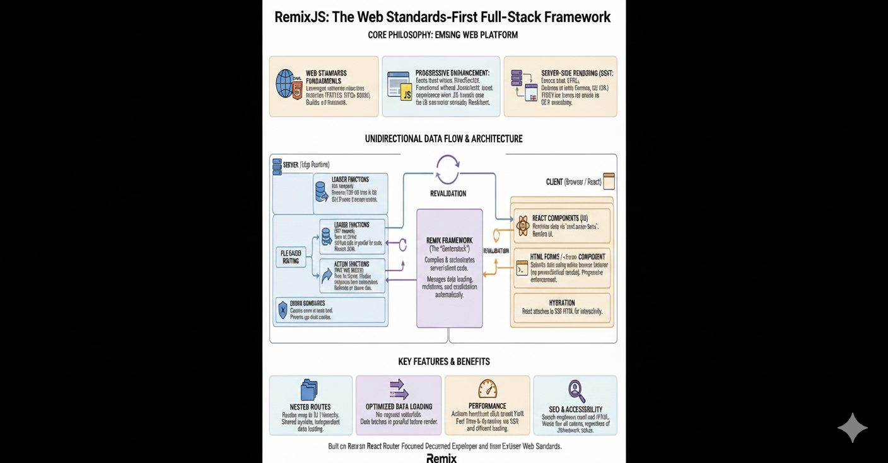

> **Note:** This article explores the internal architecture of RemixJS.

Remix is often described as a "centerstack" framework—it doesn't just run on the
client or just on the server, but bridges the gap between the two using web
standards. Understanding how it works can be broken down into four key pillars:
the Compiler, the Server-Side HTTP Handler, the Server Framework, and the
Browser Framework.



## 1. The Compiler

Everything starts with the compiler (currently built on Vite). It doesn't just
bundle your code; it creates two distinct builds:

1. **Server Build**: A single module that acts as the request handler. This
   includes your backend logic, `loaders`, and `actions`.
2. **Browser Build**: A collection of highly optimized JS modules, CSS files,
   and asset manifests.

This separation allows Remix to know exactly what code needs to run where,
enabling features like automatic code splitting by route.

## 2. The Server-Side HTTP Handler

Remix itself isn't a server. It's a handler that runs _inside_ a server. This is
a crucial distinction. It effectively translates the server's native
request/response objects (whether that's Node.js, Cloudflare Workers, or Deno)
into standard **Web Fetch API** `Request` and `Response` objects.

This "adapter" pattern is why Remix can run anywhere—it normalizes the
environment so your application code doesn't care if it's running on a Vercel
lambda or a persistent Express server.

## 3. The Server Framework

When a request hits your server, Remix takes over as an MVC framework.

- **Model**: You define this (Prisma, Supabase, direct fetch, etc.).
- **View**: Your React components.
- **Controller**: Your `loader` and `action` functions.

### The Loader (GET)

Loaders run _only_ on the server. They fetch data and pass it to your component.
Because this happens on the server, you can talk directly to your database
without exposing secrets.

```tsx
export async function loader({ params }) {
    return json(await db.post.findUnique({ where: { id: params.id } }));
}
```

### The Action (POST/PUT/DELETE)

Actions handle mutations. When you submit a standard HTML `<form>`, Remix routes
it to an `action`.

```tsx
export async function action({ request }) {
    const formData = await request.formData();
    // validate and save...
    return redirect("/dashboard");
}
```

## 4. The Browser Framework

Once the initial HTML is delivered to the browser (SSR), the Remix Browser
Framework takes over to "hydrate" the page.

Instead of full page reloads, Remix intercepts clicks and form submissions. It
uses `fetch` to call your loaders and actions, diffs the updated data, and
selectively re-renders only the parts of the page that changed. This is
"Client-Side Navigation," giving the user the snappy feel of a generic SPA while
retaining the SEO and initial load benefits of SSR.

## Progressive Enhancement

One of Remix's superpowers is that the "Browser Framework" step is technically
optional for the core functionality. Because it uses standard HTML `<form>` and
`<a>` tags, if JavaScript fails to load (or hasn't loaded yet), the browser will
perform a traditional full-page reload, and your app _still works_. The `loader`
and `action` handle the request just fine on the server.
