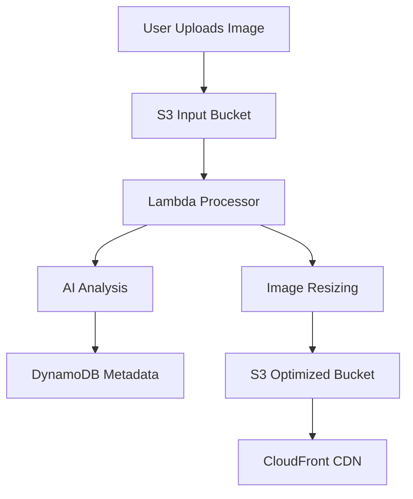

As solo developers, we are the architects, the coders, and the marketing department. We often need to explain "how it works" to users or "why it's built this way" to stakeholders. Traditionally, this meant hours of "box-nudging" in Figma.

But a new era of **Semantic Rendering** has arrived. AI doesn't just "draw" anymore; it understands your data and maps it to a visual structure. While [NotebookLM](https://notebooklm.google.com/) is the current entry point, the real power lies in the "LLM Chain."

## TLDR: The 2026 Infographic Stack

*   **Research & Synthesis:** [NotebookLM](https://notebooklm.google.com/) (Free). Best for 100+ sources.
*   **Text-to-Visual Speed:** [Napkin.ai](https://www.napkin.ai/) (Free/Paid). Best for READMEs and blog post "visual snacks."
*   **Architecture-as-Code:** [Eraser.io](https://www.eraser.io/) (Paid). Best for version-controlled system flows.
*   **Spatial Reasoning:** [Google AI Studio](https://aistudio.google.com/) (Gemini 2.0 Flash Thinking). Best for custom, complex layouts.

---

## 1. NotebookLM: The 10 Styles of Semantic Rendering

NotebookLM's March 2026 update introduced 10 distinct infographic styles. For a solo dev, choosing the right one is the difference between a "cool demo" and a professional asset.

| Style | Best For... | Solo Dev Use Case |
| :--- | :--- | :--- |
| **Bento Grid** | Feature Showcases | Your landing page "Features" section. |
| **Sketch Note** | Tutorials/Guides | "How I built this" blog posts. |
| **Scientific** | Technical Specs | Explaining a new protocol or API logic. |
| **Instructional** | Onboarding | Documentation for your open-source library. |
| **Editorial** | Whitepapers | Pitching your SaaS to enterprise clients. |
| **Clay/Anime** | Branding | Social media posts (X/LinkedIn) for "vibes." |

**Pro Recipe: The "Bento Feature Box"**
1. Upload your `README.md` and `package.json`.
2. Choose **Bento Grid**.
3. Use this prompt: *"Highlight the top 5 performance metrics. Use a dark mode theme with 'Tailwind Blue' accents. Focus on the core dependencies."*

---

## 2. The "Two-Step" Workflow for Perfect Layouts

The biggest failure of AI visuals is "AI Gibberish" and poor spatial awareness. To fix this, we split the brain: **Claude structures, Gemini renders.**

### Step 1: The Architect (Claude 3.5 Sonnet)
Feed Claude your code and ask for a **Spatial Prompt**.

**The Master Prompt:**
> "Analyze this React component tree. Generate a spatial reasoning prompt for Gemini 2.0. The output must describe a 3-column infographic:
> - **Left Col:** User Inputs (Auth, Forms)
> - **Center Col:** State Orchestration (Redux/Zustand)
> - **Right Col:** Data Persistence (Supabase/Prisma)
> Use bounding box coordinates [x, y, width, height] for each section to ensure zero overlap."

### Step 2: The Renderer (Gemini 2.0 Flash Thinking)
Go to [Google AI Studio](https://aistudio.google.com/), select **Gemini 2.0 Flash Thinking**. Paste Claude's prompt. Because Gemini 2.0 uses "System 2" thinking, it actually *plans* the pixels before drawing, ensuring your text labels aren't just squiggles.

---

## 3. Napkin.ai: The "README.md" Secret Weapon

Solo devs often have great code but "Wall of Text" documentation. [Napkin.ai](https://www.napkin.ai/) is built for this.

**The Workflow:**
1. Highlight a paragraph of text in your docs.
2. Click the "Auto-Graphic" button.
3. Napkin converts it into a **Live, Editable SVG**.

Unlike NotebookLM, Napkin allows you to **click on any icon and swap it**. If the AI chose a "cloud" icon but you need a "database" icon, it's a one-second fix.

---

## 4. Visual Example: What "Good" Looks Like

Imagine you are documenting a **Serverless Image Processor**. A "good" infographic isn't just pretty; it's a "mental model." Here is how the different tools would visualize it:

### The "NotebookLM Sketch Note" Style
*   **Visual:** Hand-drawn arrows connecting a "Lambda" icon to an "S3" bucket.
*   **Value:** Humanizes your technical stack. Great for "Build in Public" updates.
*   **Drafting Tip:** Ask for "High contrast, minimal colors" to keep it readable on mobile.

### The "Eraser.io Diagram-as-Code"
*   **Visual:** A crisp, professional flow chart using Mermaid.js syntax.
*   **Value:** It's version-controlled. When you change your stack, you just update the code, and the diagram regenerates.
*   **Drafting Tip:** Use "DiagramGPT" to turn your `infra.tf` (Terraform) files directly into the code below.

---

## 5. Visual Blueprint: The Bento Layout

When using tools like NotebookLM or Napkin.ai, you are essentially asking the AI to map your data to a grid. Here is a conceptual SVG wireframe of what the "Bento Feature Box" mentioned above looks like in practice:

  <svg width="400" height="250" viewBox="0 0 400 250" fill="none" xmlns="http://www.w3.org/2000/svg" class="max-w-full">
    <!-- Main Feature -->
    <rect x="10" y="10" width="230" height="150" rx="8" fill="hsl(var(--primary))" fill-opacity="0.1" stroke="hsl(var(--primary))" stroke-width="2"/>
    <text x="30" y="40" fill="hsl(var(--primary))" font-family="sans-serif" font-size="14" font-weight="bold">Core Performance</text>
    <rect x="30" y="60" width="190" height="10" rx="5" fill="hsl(var(--primary))" fill-opacity="0.2"/>
    <rect x="30" y="80" width="150" height="10" rx="5" fill="hsl(var(--primary))" fill-opacity="0.2"/>

    <!-- Secondary Feature 1 -->
    <rect x="250" y="10" width="140" height="70" rx="8" fill="hsl(var(--muted-foreground))" fill-opacity="0.1" stroke="hsl(var(--muted-foreground))" stroke-width="1"/>
    <text x="265" y="35" fill="hsl(var(--muted-foreground))" font-family="sans-serif" font-size="12" font-weight="bold">Dependencies</text>

    <!-- Secondary Feature 2 -->
    <rect x="250" y="90" width="140" height="70" rx="8" fill="hsl(var(--muted-foreground))" fill-opacity="0.1" stroke="hsl(var(--muted-foreground))" stroke-width="1"/>
    <text x="265" y="115" fill="hsl(var(--muted-foreground))" font-family="sans-serif" font-size="12" font-weight="bold">API Health</text>

    <!-- Bottom Wide Feature -->
    <rect x="10" y="170" width="380" height="70" rx="8" fill="hsl(var(--accent))" fill-opacity="0.1" stroke="hsl(var(--accent))" stroke-width="1"/>
    <text x="30" y="200" fill="hsl(var(--accent-foreground))" font-family="sans-serif" font-size="12" font-weight="bold">Global CDN Propagation</text>
  </svg>

---

## 6. Spatial Prompting Techniques

To get better results from any LLM, use these "Developer-First" prompting tips:

*   **Specify Coordinates:** "Place the main heading at the top-left, 10% from the edge."
*   **Define Hierarchies:** "The 'User' node should be 2x larger than the 'Database' node."
*   **Use Bounding Boxes:** "Keep all text within a central 800px column."
*   **Negative Prompting:** "No cursive fonts. No realistic human faces. No 3D drop shadows."

## Conclusion

Stop trying to be a graphic designer. As a solo dev, your time is better spent on logic. Use **NotebookLM** for the high-level research, **Claude** for the spatial planning, and **Napkin.ai** for the quick README visuals. By chaining these "Specialist" AIs together, you can produce infographics that rival a dedicated design team—at zero cost and in 1/10th of the time.
