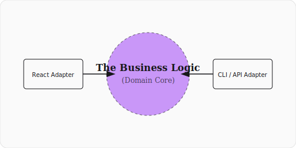
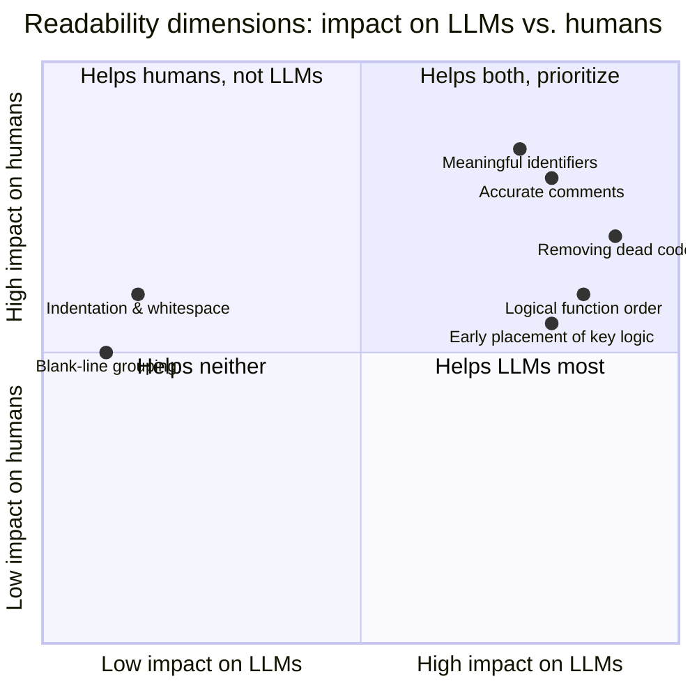

> Programs must be written for people to read, and only incidentally for
> machines to execute.
>
> Abelson & Sussman,
> [SICP](https://mitpress.mit.edu/9780262510875/structure-and-interpretation-of-computer-programs/)

Modern development creates architectural debt. Over the last decade, business
logic is often mixed with framework code. Teams inherit difficult to maintain
codebases; migration to new frameworks is painful and time-consuming. Fixing
business rules bugs requires "code archaeology."

**Narrative Code** and **Hexagonal Architecture** can mitigate and AI-assisted
development makes it even easier.

This happens for many reasons but perhaps lack of time and knowledge are the
most common.

**Agents.md** (project instructions for AI agents) and **reusable skills**
rewrite "dirty" implementations cleanly. Agent hooks and skills help apply a
narrative style.

## TLDR: The Narrative Protocol

- **Adopt a Domain-First Perspective**: Business logic belongs in pure JS/TS
  **Domain Stories**, decoupled from framework-specific hooks, state or render.
- **Hexagonal Thinking**: Use
  [Ports and Adapters](https://alistair.cockburn.us/hexagonal-architecture/) to
  keep your Domain Core clean of framework infrastructure noise.
- **SLAP (Single Level of Abstraction)**: Keep your "Chapters" focused. Never
  mix high-level policy with low-level primitives.
  [Adhering to SLAP](http://principles-wiki.net/principles:single_level_of_abstraction)
  results in smaller, more readable methods.
- **The AI Signal**: Narrative code turns your codebase into a "High-Resolution"
  map for AI agents, dramatically reducing hallucinations.
- **Security by Prose**: When code reads like English, logic flaws become "Plot
  Holes." See [Security by Prose](#security-by-prose) below.

---

## 📋 The Narrative Checklist

Your code is narrative when you can answer **yes** to every question below. Use
these as a code review checklist.

1. **"Read it aloud"** — Can you narrate the function body as one plain-English
   sentence?\
   _No:_ `if (user.isPremium && cart.total > 100 && hasElectronics) { ... }`\
   _Yes:_
   `if (isEligibleForDiscount(user, cart) && isElectronicSpecial(cart)) { ... }`

2. **"One level, please"** — Does every function stay at a single level of
   abstraction?\
   _No:_ `setDiscount(cart.total * 0.15); // mixed policy + math`\
   _Yes:_ `setDiscount(applyPremiumRate(cart.total));`

3. **"Business vocabulary"** — Would a non-technical stakeholder recognize the
   names?\
   _No:_ `processUser(...)`, `handleSubmit(...)`, `checkFlag(...)`\
   _Yes:_ `isEligibleForDiscount(...)`, `calculateReward(...)`,
   `applyPremiumRate(...)`

4. **"Zero framework"** — Is the domain logic pure, free of framework imports?\
   _No:_ file imports `useState`, `useEffect`, `Suspense`\
   _Yes:_ file imports zero UI framework modules — pure TS/JS

5. **"Small chapter"** — Can you see the full function without scrolling? (<7
   lines)\
   _No:_ a 30-line function with nested conditionals\
   _Yes:_ every function is short enough to grasp at a glance

A "no" on any question is not a bug. It is a refactoring candidate. Extract and
re-architect until the answer to every question is "yes".

---

## 🏚️ The Challenge: Framework Entanglement

Business logic embedded in components. Fast to write, painful to maintain.

### The Entangled Implementation

```tsx
// DiscountManager.tsx
// Logic is coupled to the framework lifecycle.
// Un-testable in isolation.
// Coupled to React's rendering engine.
export function DiscountManager({ user, cart }) {
  const [discount, setDiscount] = useState(0);

  useEffect(() => {
    if (user.isPremium && cart.total > 100) {
      if (cart.items.some((i) => i.category === "electronics")) {
        setDiscount(cart.total * 0.15); // Hardcoded "Plot Hole"
      } else {
        setDiscount(cart.total * 0.10);
      }
    }
  }, [user, cart]);

  return <div>Discount: ${discount}</div>;
}
```

In this example, the **Story** (how we reward premium users) is buried inside
the **Machinery** (`useEffect`, `useState`). Moving to Svelte or running the
logic server-side requires a rewrite.

---

## 🏗️ The Solution: Narrative Core + Hexagonal Architecture

Pair Narrative Code with
[Hexagonal Architecture](https://en.wikipedia.org/wiki/Hexagonal_architecture_(software))
(Ports & Adapters). Business logic = Core. Frameworks (React, Svelte, etc.) =
Adapters.

We'll build up in two steps.

### Step 1: Direct Import (Separation of Concerns)

First, extract the pure logic into a domain file. Have the React component
import it directly. This is a quick win.

```ts
// discount.domain.ts (The Story)
// Pure TS. Zero dependencies.
// This reads like the business requirement document.

type Money = number;
type User = { isPremium: boolean };
type Cart = { total: Money; items: { category: string }[] };

// These can be tested in isolation.
const ELECTRONICS = "electronics";
export const isElectronicsCategory = (category: string) =>
  category === ELECTRONICS;
export const isEligibleForDiscount = (
  user: User,
  cart: Cart,
): boolean => user.isPremium && cart.total > 100;
export const applyPremiumRate = (total: Money): Money => total * 0.15;
export const applyStandardRate = (total: Money): Money => total * 0.10;
export const isElectronicSpecial = (cart: Cart) =>
  cart.items.some((i) => isElectronicsCategory(i.category));

export function getRate(hasSpecialItems: boolean): (total: Money) => Money {
  return hasSpecialItems ? applyPremiumRate : applyStandardRate;
}

export function calculateReward(user: User, cart: Cart): Money {
  if (!isEligibleForDiscount(user, cart)) return 0;

  const applyRate = getRate(isElectronicSpecial(cart));

  return applyRate(cart.total);
}
```

Now, the React component is just a thin "Adapter" that calls the story:

```tsx
// DiscountDisplay.tsx (The Adapter)
export function DiscountDisplay({ user, cart }) {
  const discount = calculateReward(user, cart);
  return <div>Discount: ${discount}</div>;
}
```

This separates logic from framework, but the adapter still depends on concrete
functions directly. There is no interface boundary.

### Step 2: Full Hexagonal Architecture (Ports & Adapters)

Define explicit **ports** (interfaces) in the domain core. Adapters depend on
ports, not implementations.

```ts
// reward.domain.ts (Core with Port)
// The Core defines the contract; adapters fulfill it.

export interface RewardCalculator {
  calculateReward(user: User, cart: Cart): Money;
}

function calculate(user: User, cart: Cart): Money {
  if (!isEligibleForDiscount(user, cart)) return 0;
  const applyRate = getRate(isElectronicSpecial(cart));
  return applyRate(cart.total);
}

export function createRewardCalculator(): RewardCalculator {
  return { calculateReward: calculate };
}
```

The inbound adapter depends on the port interface:

```tsx
// RewardDisplay.tsx
interface RewardDisplayProps {
  calculator: RewardCalculator;
  user: User;
  cart: Cart;
}

export function RewardDisplay({ calculator, user, cart }: RewardDisplayProps) {
  return (
    <div>
      Reward: ${calculator.calculateReward(user, cart)}
    </div>
  );
}
```

Wiring at the composition root:

```tsx
// App.tsx (Composition Root)
const calculator = createRewardCalculator();

function App() {
  return <RewardDisplay calculator={calculator} user={user} cart={cart} />;
}
```



### Why This Wins

1. **Readability**: Non-technical stakeholders verify the logic against explicit
   port contracts.
2. **Testability**: Unit test the domain logic in isolation, or mock the ports.
3. **Auditability**: Missing ports or eligibility checks stand out as plot
   holes.

### The Trade-Off: More Functions

Narrative code produces more, smaller functions than framework-entangled code.
This means more files to open and more indirection to follow. Navigating a
codebase with many small units can feel scattered compared to a monolithic
component.

This is a real cost, but the benefits of separation of concerns weigh heavier:

- **Each function has one reason to change**, making debugging and modification
  safer.
- **Small units compose** — you reuse `isEligibleForDiscount`, you don't
  copy-paste a `useEffect`.
- **Navigation is a tooling problem**, not a design flaw. Go-to-definition,
  outline panels, and minimaps turn small functions into an asset, not a
  liability.

Trade it: a few extra tabs open in exchange for logic you can read, test, and
trust in isolation. Not to mention modern IDEs are very good at navigating
around to the relevant functions.

---

## 🧠 The Cognitive Case for Storytelling

Yehonathan Sharvit identifies three
[brain spans](https://semaphore.io/blog/storytelling-programming) governing
comprehension. Narrative code respects each:

| Brain Span         | Capacity    | The Narrative Fix                                               |
| :----------------- | :---------- | :-------------------------------------------------------------- |
| **Memory Span**    | ~7 items    | Small functions (<7 lines).                                     |
| **Attention Span** | ~20 minutes | SLAP: All lines in a function share an abstraction level.       |
| **Structure Span** | What vs How | Function names describe _What_; implementation describes _How_. |

---

## ⚠️ The "Bystander Effect" in Code Reviews

Framework-entangled code triggers the
**[Bystander Effect](https://en.wikipedia.org/wiki/Bystander_effect)**.
Reviewers see dense logic mixed with noise (hooks, types, state) and assume
someone else verified it. They check syntax, not intent.

**Narrative code reverses this.** Strip the noise, present logic as prose.
Reviews become "verifying the logic," not "checking for semicolons."

> When code reads like a story, a missing 'else' isn't a syntax error. It is a
> plot hole.

### Security by Prose

Narrative code turns security audits into sanity checks. In framework-entangled
code, IDOR vulnerabilities hide in hook noise. In a Narrative Core, a missing
authorization check in `transferFunds` or `updateIdentity` is as obvious as a
missing character in a play.

```ts
// Narrative Security: The missing check is obvious.
export function updateIdentity(currentIdentity, newData) {
  if (canModify(currentIdentity)) return { ...currentIdentity, ...newData };
  throw new PermissionDenied();
}
```

> **Narrative Code is a guideline, not a guarantee.** Readability makes security
> gaps more visible, but it doesn't replace dedicated security practices.
> Production systems still need input validation, rate limiting, dependency
> scanning, threat modeling, and thorough test coverage. Clean code exposes plot
> holes — it doesn't fill them.

---

## 🤖 AI as a First-Class Reader

In 2026, AIs read your code as much as humans. Coding agents like
[OpenCode](/blog/2026-02-05-opencode-ai-coding-agent) thrive on **Semantic
Signaling**[^1].

Logic buried in `useEffect` forces the AI to parse framework reconciliation
noise. That is where hallucinations have opportunity.

A pure Domain Core gives AI a high-resolution signal while noise is minimised.
In framework-heavy code, LLMs burn reasoning tokens separating business logic
from hook boilerplate. That dilution causes hallucinations [^2]. A Narrative
Core is a high-quality prompt: agents refactor and generate tests with higher
accuracy because the business story is the only thing on the page [^3].

The scale of the effect is stark. Haroon et al. (2025) [^2] gave LLMs debugging
tasks they had previously solved correctly. After applying mutations that only
changed identifiers, comments, or function order (but not behavior), the models
failed **81%** of the time.

> Function shuffling alone collapsed accuracy by **83%**.

The same study found that **60%** of correctly localised faults were in the
first 25% of a file. Only 13% were in the last quarter. Code buried under
boilerplate or placed late in a module is nearly invisible to LLMs.

### Practical Setup: Coaching the Model

Unfortunately, simply telling the LLM to write clean and maintainable code is
not enough.

**ESLint** enforces narrative rules (function length, abstraction levels,
naming). **Agents.md** and **skills** are instructions the model follows, not
suggestions. Models trained on all code default to framework-entangled patterns.
Linting + explicit instructions + narrative examples in your codebase shift
output toward clean, domain-first code.

---

## 📌 Conclusion: Building Portable Assets

Frameworks come and go. If your logic is mixed with the framework, maintenance
and migration are much harder.

**Narrative Code** transforms your codebase into portable business assets. Don't
just write an app. Write the manual for how your business works in executable
prose.

Start today: extract **one** business rule into a pure `*.domain.ts` file.
Discuss with your team if they can understand and see the vaue of the approach.
It might not get acceptance right away but I hope that especially the seniors
can appreciate the long term benefits of this approach.

Next time you open a file, ask: _Is this a story, or just glue?_ Based on that
answer, you can then decide whether it is worthwile to refactor the code to be
more narrative. Do not refactor everything at once. Instead, refactor one file
at a time. The benefits will become obvious over time.

---

## 🔗 Sources & References

- [The Secret Art of Storytelling in Programming](https://semaphore.io/blog/storytelling-programming)
  - Yehonathan Sharvit
- [Coding like Shakespeare](https://dmitripavlutin.com/coding-like-shakespeare-practical-function-naming-conventions/)
  - Dmitri Pavlutin
- [Your Code Should Tell a Story](https://medium.com/better-programming/your-code-should-tell-a-story-8e9d42e91ef2)
  - Madhavan Nagarajan
- [Your Code Is a Story: Writing Software That Reads Like Prose](https://www.nottldr.com/CodeCraft/your-code-is-a-story-writing-software-that-reads-like-prose-0g4oi0d)
  - CodeCraft
- [Intention-Revealing Function Names](https://www.freecodecamp.org/news/how-to-make-your-code-better-with-intention-revealing-function-names-6c8b5271693e/)
  - Cristian Salcescu
- [Intent-Revealing Code: Writing for Humans, Not Just Machines](https://naveenkumarmuguda.medium.com/intent-revealing-code-writing-for-humans-not-just-machines-f1a310f0b934)
  - Naveen Muguda
- [Hexagonal Architecture: Decoupling Logic from Frameworks](https://medium.com/@vansh.khandelwal06/hexagonal-architecture-decoupling-business-logic-from-frameworks-02bfbfbd7162)
  - Vansh Khandelwal
- [Path To A Cleaner React Architecture](https://dev.to/jkettmann/path-to-a-cleaner-react-architecture-part-6-business-logic-separation-221g)
  - Johannes Kettmann
- [Single Level of Abstraction Principle](https://www.c-sharpcorner.com/article/single-level-of-abstraction-principle-slap-write-code-that-tells-a-story-in-c/)
  - Naresh Kumar Katta
- [Clean Code](https://www.oreilly.com/library/view/clean-code-a/9780136083238/)
  - Robert C. Martin
- [Code-teller: The Art of Narrating Code](https://blog.stackademic.com/code-teller-the-art-of-narrating-code-69523493e6b6)
  - Manuel Suricastro
- [OWASP Insecure Direct Object Reference (IDOR) Guide](https://owasp.org/www-community/attacks/insecure_direct_object_reference)
  - OWASP Foundation
- [The Bystander Effect](https://en.wikipedia.org/wiki/Bystander_effect),
  Wikipedia
- [How Accurately Do Large Language Models Understand Code?](https://arxiv.org/abs/2504.04372)
  — Haroon et al., Virginia Tech & CMU, ICSE-FoSE 2025
- [The Code Barrier: What LLMs Actually Understand?](https://arxiv.org/abs/2504.10557)
  — Nikiema et al., University of Luxembourg, 2025
- [The Hidden Cost of Readability: How Code Formatting Silently Consumes Your LLM Budget](https://arxiv.org/abs/2508.13666)
  — Pan et al., Monash & SMU, ICSE 2026
- [Code Readability in the Age of Large Language Models](https://arxiv.org/abs/2501.11264)
  — Takerngsaksiri et al., Monash & Atlassian, ICSME 2025

---

## 📖 Appendix: The Empirical Case for Semantic Cleanliness

The intuition that "clean code is easier for AI too" is supported by
peer-reviewed evidence. But there is a crucial distinction. _Semantically clean_
code uses meaningful names, accurate comments, logical structure, and no dead
code. It measurably improves LLM comprehension. _Cosmetically clean_ formatting
uses indentation and whitespace. It makes almost no difference to LLMs.
Readability dimensions that carry semantic signal help AI. The ones that only
serve human visual parsing do not.

### A.1 Core Evidence

The most directly relevant study is **"How Accurately Do Large Language Models
Understand Code?"** (Haroon et al., Virginia Tech & CMU, ICSE-FoSE 2025). The
authors evaluated 9 LLMs on 575,000 debugging tasks. They generated these tasks
by injecting real faults. Then they applied _semantic-preserving mutations_
(SPMs). These include misleading variable names, misleading comments, dead-code
injection, and function shuffling. The mutations change nothing about program
behavior. They degrade readability. Key findings:

- LLMs failed to localize faults in **81% of tasks** once semantic-preserving
  mutations were added. They had correctly located the _same_ faults in the
  clean version.
- **Function shuffling** alone (reordering function definitions) cut debugging
  accuracy by **83%**. Code structure and order matters to LLMs as much as to
  humans.
- Accuracy declined _linearly_ as mutation strength rose. In Python from 43.0%
  (strength 1) to 27.6% (strength 8). In Java from 14.8% to 6.7%.
- Location bias: **60% of correctly localized faults were in the first 25%** of
  a program's lines. Only 13% were in the last 25%. The structural position of
  code strongly conditions LLM understanding.
- Cumulative mutations were devastating. Variable plus comment combined dropped
  accuracy to **22.7%**. Dead-code cumulative dropped it to **15.8%**.

The authors conclude that "LLMs' ability to understand code semantics is overly
influenced by non-functional properties of code." Their reliance on attention
over comments, names, and structure is a genuine weakness.

### A.2 Corroborating Studies

**"The Code Barrier: What LLMs Actually Understand?"** (Nikiema et al.,
University of Luxembourg, 2025) tested 13 models. These include GPT-4o and
StarCoder2. They used 250 Java problems from CodeNet under controlled
obfuscation. They found a **statistically significant performance decline as
obfuscation complexity increased**. This applied to both description-generation
and deobfuscation tasks. It indicates that LLMs' semantic representation
mechanisms are constrained by surface-level code features.

**"Code Readability in the Age of Large Language Models"** (Takerngsaksiri et
al., Monash & Atlassian, ICSME 2025) combined a practitioner survey with a
comparison of LLM-generated vs. human-written code on 144 real Jira tasks. It
found LLM-generated code readability is _comparable_ to human code.
Practitioners still treat readability as critical. It governs how reliably both
humans and AI agents can later maintain, debug, and extend the code.

**"The Hidden Cost of Readability: How Code Formatting Silently Consumes Your
LLM Budget"** (Pan et al., Monash & SMU, ICSE 2026) is the counterpoint that
refines the picture. The study covered 4 languages and 10 LLMs. The task was
Fill-in-the-Middle completion. Removing _whitespace, indentation, and newlines_
had **negligible impact on correctness**. It cut input tokens by 24.5%. The
authors explicitly state that "visual aids do not seem to be beneficial for LLMs
in the same way since the code is processed as a linear sequence of tokens."

### A.3 Readability Dimensions: Impact on LLMs and Humans

The following chart maps how different readability dimensions affect LLMs versus
humans. It is based on the effect sizes reported across these studies:



### A.4 Summary of the Studies

| Study (year)                                                        | Method                                                      | Readability dimension tested                                                        | Effect on AI                                                                                         |
| ------------------------------------------------------------------- | ----------------------------------------------------------- | ----------------------------------------------------------------------------------- | ---------------------------------------------------------------------------------------------------- |
| Haroon et al., "How Accurately Do LLMs Understand Code?" (2025)     | 9 LLMs, 575K debugging tasks, semantic-preserving mutations | Misleading names, misleading comments, dead code, function shuffling, code location | 81% failure on mutated code; 83% accuracy drop from shuffling; linear decline with mutation strength |
| Nikiema et al., "The Code Barrier" (2025)                           | 13 models, 250 Java problems, controlled obfuscation        | Lexical (renaming), structural (dead code), semantic (encryption) obfuscation       | Statistically significant decline in description + deobfuscation accuracy as obfuscation grows       |
| Pan et al., "Hidden Cost of Readability" (2025)                     | 10 LLMs, 4 languages, Fill-in-the-Middle completion         | Whitespace, indentation, newlines (pure formatting)                                 | Negligible accuracy change; 24.5% token savings when removed                                         |
| Takerngsaksiri et al., "Code Readability in the Age of LLMs" (2025) | Practitioner survey + 144 Jira tasks, GPT-4 agent           | Overall readability of LLM- vs. human-written code                                  | LLM code ≈ human code readability; readability still rated critical for maintainability              |

### A.5 Why This Asymmetry Exists

The mechanism is well explained by the Virginia Tech authors. LLMs use
Transformer attention. It "unintentionally assign[s] equal significance to
non-functional elements, such as comments and dead code." This causes LLMs to
treat semantically irrelevant tokens as meaningful signal (Haroon et al., 2025).
Humans use domain knowledge to discount dead code and misleading names. LLMs
lack that robust filtering. Noisy code actively _misleads_ them. Indentation and
whitespace carry no semantic token for the attention mechanism to latch onto.
Their removal is harmless. The model never relied on visual layout the way a
human reader does (Pan et al., 2025). The Code Barrier study reaches the same
conclusion. Models can sometimes identify an obfuscation technique while still
failing to reconstruct the underlying logic. This points to "limitations in
their semantic representation mechanisms" (Nikiema et al., 2025).

### A.6 Practical Implications

- **Meaningful names and accurate comments help AI as much as humans.** They are
  semantic anchors the attention mechanism uses. Misleading ones actively
  degrade accuracy, sometimes catastrophically when combined (Haroon et al.,
  2025).
- **Removing dead code matters more for AI than for humans.** LLMs are most
  sensitive to dead-code injection. They treat unreachable code as functionally
  relevant (Haroon et al., 2025).
- **Code order and modularity matter.** Function shuffling caused the single
  largest accuracy drop (83%). Faults placed late in a file are far less likely
  to be found. Keeping critical logic early and well-organized materially helps
  LLM comprehension (Haroon et al., 2025).
- **Indentation and whitespace are largely free to strip for inference
  efficiency.** They cost tokens without buying accuracy. Format-stripping
  preprocessors are a legitimate optimization when feeding code to LLMs (Pan et
  al., 2025).
- **The cleaner-code-for-AI effect is empirical, not folk wisdom.** It has been
  measured at scale (575K tasks, 13 models, 4 languages) with statistical
  significance. The failure mode is specifically a _semantic_ one, not a
  token-budget one (Haroon et al., 2025; Nikiema et al., 2025).

[^1]: See Appendix §A. A growing body of peer-reviewed research confirms that
    semantically clean code (meaningful names, accurate comments, logical
    structure, no dead code) measurably improves LLM comprehension. Purely
    cosmetic formatting (indentation, whitespace) does not.

[^2]: Haroon et al. (2025). See Appendix §A.1 for the full experimental
    breakdown and key numbers.

[^3]: See Appendix §A for the complete synthesis of all four studies and their
    practical implications.
